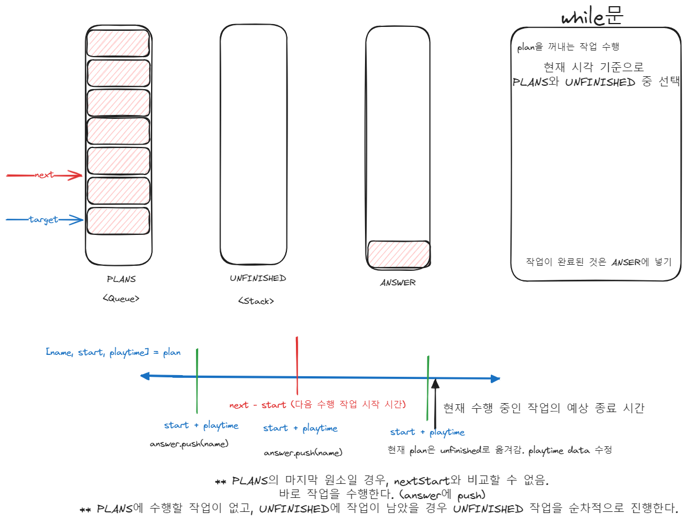

# 문제 링크

프로그래머스 Lv.2 과제 진행하기
https://school.programmers.co.kr/learn/courses/30/lessons/176962

# 1. 내 풀이

```js
function solution(plans) {
    // start를 min 단위로 변경
    plans.forEach((plan) => (plan[1] = convertToMin(plan[1])));
    // start 기준 오름차순으로 정렬
    plans.sort((a, b) => a[1] - b[1]);

    const answer = [];
    const unfinishedStack = []; // 대기중 작업 stack

    let idx = 0;
    let endTime = plans[0][1] + Number(plans[0][2]); // 현재 시간 위치
    while (idx < plans.length || unfinishedStack.length > 0) {
        let plan = plans[idx];
        if (!plan) {
            // unfinishedStack만 남은 상태
            answer.push(unfinishedStack.pop()[0]);
            continue;
        }

        // 현재 작업할 대상 꺼내기. plans vs unfinishedStack.
        // plans에서 꺼내게 될 경우, idx는 +1 해준다.
        if (plan[1] <= endTime) {
            idx++;
        } else {
            // plan[1] > endTime
            let popped = unfinishedStack.pop();
            if (popped) {
                popped[1] = endTime; // start 시간 변경
                plan = popped;
            } else {
                idx++;
            }
        }

        // 다음 수행할 작업 대상의 start 시간과 비교
        let [name, start, playtime] = plan;
        endTime = start + Number(playtime); // 현재 작업 중인 작업의 예상 종료 시간

        if (idx < plans.length) {
            let nextStart = plans[idx][1];
            if (endTime > nextStart) {
                plan[2] = endTime - nextStart; // 남은 작업 수행시간 변경
                unfinishedStack.push(plan); // 대기 작업
            } else {
                answer.push(name);
            }
        } else {
            // 마지막 plans의 작업
            answer.push(name);
        }
    }

    return answer;
}

function convertToMin(hhmm) {
    const [hour, min] = hhmm.split(':').map(Number);
    return hour * 60 + min;
}
```

## 풀이 방법

나올 수 있는 경우의 수를 찾아 분기 처리 했다.

# 2. 느낀 점

이중 if문을 많이 사용했는데, 불필요한 중복을 줄이고 직관적으로 리팩토링 하고 싶다.

# 3. 배운 점

경우의 수가 많아지니 조건문을 세울 때 많이 헷갈렸다.
그림으로 정리하니 도움이 되었다.

