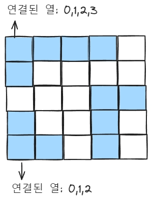

# 문제 링크

[PCCP 기출문제 2번](https://school.programmers.co.kr/learn/courses/30/lessons/250136)

# 1. 내 풀이

```js
function solution(land) {
  const dR = [-1, 0, 1, 0];
  const dC = [0, 1, 0, -1];
  const rLen = land.length;
  const cLen = land[0].length;
  const oilByCol = {}; // {열: 뽑을 수 있는 석유량}

  for (let c = 0; c < cLen; ++c) {
    const queue = [];
    // 한 열에서 row를 순회하며 석유 찾기
    for (let r = 0; r < rLen; ++r) {
      // 석유를 찾음. 연결된 총 석유량 구해서 oilByCol에 더하기
      if (land[r][c] === 1) {
        land[r][c] = 0; // 현재 위치는 이미 뽑은 석유로 변경
        let sum = 1; // 석유량 초기화
        let connectedCols = new Set(); // 현재위치와 연결된 열의 set
        connectedCols.add(c);
        queue.push({ r, c });

        // 현재위치와 연결된 열과 총 석유량 구하기
        while (queue.length) {
          const { r, c } = queue.shift();
          for (let i = 0; i < 4; ++i) {
            const nextR = r + dR[i];
            const nextC = c + dC[i];

            if (
              nextR >= 0 &&
              nextR < rLen &&
              nextC >= 0 &&
              nextC < cLen &&
              land[nextR][nextC] === 1
            ) {
              // 주변에 석유가 있고 새로운 열이면 연결된 열set에 추가
              if (!connectedCols.has(nextC)) connectedCols.add(nextC);
              sum++;
              land[nextR][nextC] = 0;
              queue.push({ r: nextR, c: nextC }); // 주변열의 다음 주변을 확인한다.
            }
          }
        }
        // oilByCol의 연결된 열에 현재 석유그룹의 총 석유량 더하기
        for (const c of connectedCols) {
          oilByCol[c] = (oilByCol[c] || 0) + sum;
        }
        connectedCols = new Set(); // 다음 석유그룹을 찾기위해 초기화
      }
    }
  }
  const values = Array.from(Object.values(oilByCol));
  return Math.max(...values);
}
```

## 풀이 방법

세로 열마다 석유를 찾는데, 석유가 있으면 주변을 탐색하고
하나의 항마다 가능한 석유량을 뽑고 각 항의 합을 구한다

- 열(col)마다 행(row)를 순회한다
- 행을 순회할 때 석유를 찾으면 연결된 총 석유량을 구하고, 연결된 열마다 이 석유량을 더한다.

  - 이 때 bfs를 통해 상하좌우를 검색하며 현재위치와 연결된 열과 해당 석유그룹의 총 석유량을 구한다.
    

  - 예를 들어 위 그림의 2행0열에서 석유를 찾으면 석유량8을 연결된 열 0,1,2에 각각 더한다. 0행3열의 석유량7은 3,4,5,6 열에 더한다. 4행6열의 석유량2는 6,7 행에 더한다.

- 최종적으로 각 열마다 뽑을 수 있는 석유량이 구해지면 최대 석유량을 리턴한다.
  </br>
  </br>

# 2. 느낀 점

문제를 읽으면서 재귀적으로 연결된 석유량을 구하는 건 알 수 있었다. dfs, bfs중 dfs는 top-> bottom에서 다시 bottom->top으로 돌아오기 때문에 bfs가 효율적이라 생각하여 선택했다.

한 석유그룹의 석유량을 구하면 이를 기억해서 사용할 수 있다

따라서 bfs + memory 유형이라고 생각한다.
</br>
</br>

# 3. 배운 점

isVisited 필요없고 바로 land를 변경한다

- 처음에는 각 열을 검색할 때마다 land를 복사하여 isVisited 만들어서 방문한 곳을 구분했는데 생각해보니 이렇게 하면 동일한 석유 그룹을 중복하여 검색하는 것임을 깨달았다. 대신 방문한 곳은 바로 land를 변경하고 연결된 열에 석유량을 더하면 된다.
  한 열에 여러 개의 석유 그룹이 있는 경우, 그룹마다 연결된 열은 각각 다르다
  </br>
  

- 반례

  - 입력: [[1, 1, 1, 1, 0], [1, 0, 0, 0, 0], [0, 0, 0, 1, 1], [1, 0, 0, 1, 0], [1, 1, 0, 1, 0]] , 기댓값: 9

- 따라서 열을 순회할 때 석유를 찾을 때마다 연결된 열의 set을 초기화해야한다.
