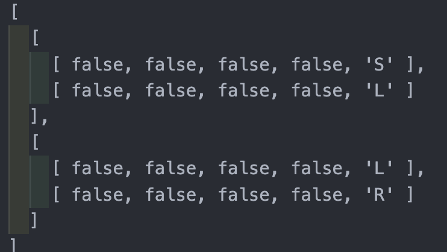

# 문제 링크

https://school.programmers.co.kr/learn/courses/30/lessons/86052

# 1. 내 풀이

```jsx
const direct = {
	right: [0, 1],
	left: [0, -1],
	top: [-1, 0],
	down: [1, 0],
}

const dirStr = ["right", "left", "top", "down"]
function solution(grid) {
	const arr = grid.map((item) => item.split(""))

	const answer = []
	for (let i = 0; i < 4; i++) {
		let count = 0
		let cur = [0, 0, ...direct[dirStr[i]]]
		const stack = [cur]
		while (stack.length > 0) {
			const [curX, curY, curDirectX, curDirectY] = stack.pop()
			if (stack.includes(`${curX} ${curY} ${curDirectX} ${curDirectY}`)) {
				answer.push(count)
				break
			} else {
				count += 1
				if (arr[curX][curY] === "S") {
					const nextX = (curX + curDirectX) % arr[0].length
					const nextY = (curY + curDirectY) % arr.length
					stack.push([nextX, nextY, curDirectX, curDirectY])
				} else if (arr[curX][curY] === "L") {
					if (curDirectX === 0 && curDirectY === 1) {
						const nextX = (curX - 1) % arr[0].length
						const nextY = (curY + curDirectY) % arr.length
						stack.push([nextX, nextY, curDirectX, curDirectY])
					} else if (curDirectX === 0 && curDirectY === -1) {
						const nextX = (curX + curDirectX) % arr[0].length
						const nextY = (curY + curDirectY) % arr.length
						stack.push([nextX, nextY, curDirectX, curDirectY])
					} else if (curDirectX === 1 && curDirectY === 0) {
						const nextX = (curX + curDirectX) % arr[0].length
						const nextY = (curY + curDirectY) % arr.length
						stack.push([nextX, nextY, curDirectX, curDirectY])
					} else if (curDirectX === -1 && curDirectY === 0) {
						const nextX = (curX + curDirectX) % arr[0].length
						const nextY = (curY + curDirectY) % arr.length
						stack.push([nextX, nextY, curDirectX, curDirectY])
					}
				} else if (arr[curX][curY] === "R") {
				}
			}
		}
	}

	return answer
}
```

# 정답풀이

```jsx
function solution(grid) {
	const dx = [1, 0, -1, 0]
	const dy = [0, 1, 0, -1]

	const visited = [...new Array(grid.length)].map((_, i) =>
		grid[i].split("").map((el) => [...new Array(4).fill(false), el])
	)
	const colLen = visited[0].length
	const rowLen = visited.length

	const ret = []

	// 인덱스 0~range으로 조정
	const makeRange = (num, range) => {
		if (num < 0) return range + num
		return num % range
	}

	for (let i = 0; i < rowLen; i++) {
		for (let j = 0; j < colLen; j++) {
			for (let k = 0; k < 4; k++) {
				if (visited[i][j][k]) continue

				visited[i][j][k] = true
				const nx = makeRange(i + dx[k], rowLen)
				const ny = makeRange(j + dy[k], colLen)
				//다음 지나갈 곳을 설정
				const stk = [[nx, ny, k]]
				let cnt = 1
				while (stk.length) {
					let [x, y, d] = stk.pop()
					const state = visited[x][y][4]
					console.log(d)
					// 왼쪽 회전이면 dx,dy배열에서 각각 -1, R이면 1씩 더한것과 같음
					if (state === "L") d = makeRange(d + 1, 4)
					else if (state === "R") d = makeRange(d - 1, 4)
					if (visited[x][y][d]) continue
					visited[x][y][d] = true
					const nx = makeRange(x + dx[d], rowLen)
					const ny = makeRange(y + dy[d], colLen)
					stk.push([nx, ny, d])
					cnt++
				}
				ret.push(cnt)
			}
		}
	}

	return ret.sort((a, b) => a - b)
}

console.log(solution(["SL", "LR"]))
```



### 결과

(0,0)을 기준으로 4방향을 돌면서 while문으로 끝까지 탐색해서(bfs) 카운팅을 하고 반환하는 방식을 사용하려했다.

나갈때와 들어올때 네방향을 스택에 집어넣으면서 꺼낸 스택값(좌표,방향)이 겹치면 while문을 빠져나오는 방식이다.

하지만, 조건에 따라 방향을 바꾸는 것이 매우 복잡해져서 풀리지가 않았다.

### 풀이 방법

- visited 배열에 [상,하,좌,우,방향]에 대해 (0,0,0,0,"S")와 같은 배열을 요소 하나당 만든다.
- 네 방향을 돌면서 while문 안에서 싸이클을 돌면서 방문 체크를 하면서 이미 방문한 경우 while문을 빠져나와 카운트를 배열에 집어넣는다.

핵심은

- `makeRange`를 통해 인덱스가 0~n을 벗어날때 0~n으로 조정하는 것
- `direct`배열을 통해 직진, 좌회전, 우회전 구현
