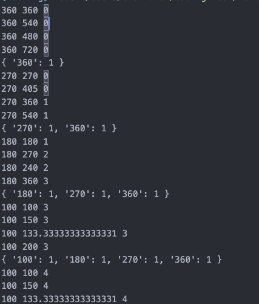

# 문제 링크

https://school.programmers.co.kr/learn/courses/30/lessons/152996

# 1. 풀이

```jsx
// 처음 풀이

// function solution(weights) {
// 	weights.sort((a, b) => a - b)
// 	let count = 0
// 	for (let i = 0; i < weights.length; i++) {
// 		for (let j = i + 1; j < weights.length; j++) {
// 			for (let k = 0; k < siso.length; k++) {
// 				if (weights[i] * siso[k] === weights[j]) {
// 					count += 1
// 				}
// 			}
// 		}
// 	}
// 	return count
// }

function solution(weights) {
	const siso = [1, 3 / 2, 4 / 3, 2]
	let count = 0
	const store = {}
	weights
		.sort((a, b) => b - a)
		.forEach((w) => {
			siso.forEach((i) => {
				if (store[w * i]) {
					// 앞에나오는게 여러번일 수 있으니
					count += store[w * i]
				}
			})
			if (!store[w]) {
				store[w] = 1
			} else {
				store[w] += 1
			}
			console.log(store)
		})
	return count
}
```

### 결과

예전에 풀었던거라 시소 경우의수를 따로 배열로 선언하고 구현하는 풀이방식이 금방 생각이났는데 오름차순으로 풀어서 통과가 안됐다. 쉽게 풀줄 알았는데 생각보다는 어려운 문제 였고 풀지 못했다.

### 풀이 방법

내림차순 정렬 후 배열을 순회하면서 `store`객체에 `count`값을 업데이트 시킨다.(최초 등장시 1, 이후 1씩 누적)

이와 동시에 이전 로직에 시소 경우의 수 배열을 순회하면서 나온 값을 `count`에 누적시키는 것 추가



직관적으로 설명하자면 내림차순으로 왼쪽부터 돌면서 값들의 경우의수 시소값을 모두 체크한다. 내림차순으로 정렬해야만 값들이 자신보다 크거나 같은 비율을 따져 꼬이지 않고 비교할 수 있다.
