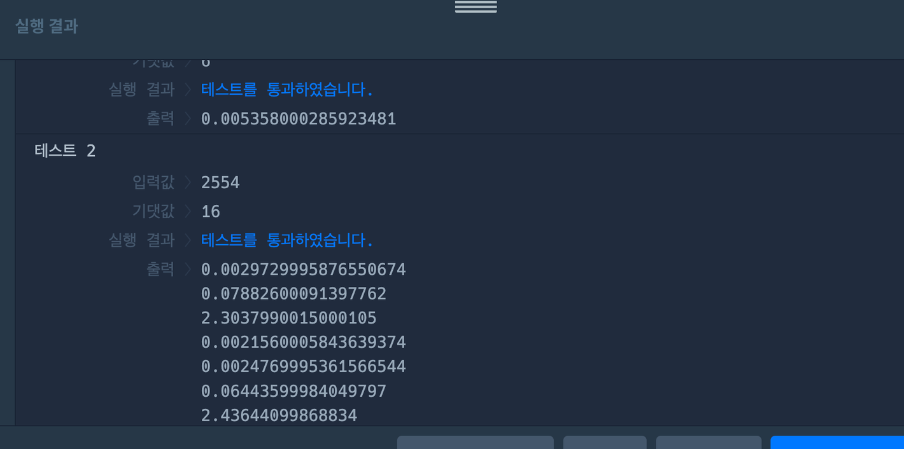

# 1. 문제 파악

## 1-1. 주어진 정보

### 인자

1. storey : 민수와 마법의 엘리베이터가 있는 층

### 리턴값

- 0층으로 가기 위해 필요한 최소한의 마법의 돌

### 전제 조건

1. +1,-1,+10,-10.. 같이 절대값이 10의 n제곱인 형태인 정수들이 적힌 버튼 존재
2. 0층이 가장 아래층, 엘리베이터는 현재 민수가 있는 층에 존재
3. 버튼 한 번 = 마법의 돌 한 개

### 분석

- 2554는 2000 + 500 + 50 + 4로 분리할 수 있다.
    - 1차원 적으로 생각하면 2 + 5 + 5 + 4 = 16이다.
- 16은 10 + 6이다.
    - 1차원적으로 생각하면 1 + 6 = 7이다.
- 위와 같이 5보다 큰 수의 경우, 윗자리수에 1을 더하고, 아랫 자릿수에 나머지를 빼는 것이 더 효율적이다.

### 분석 결과

- +1,-1,+10,-10,+100,.. 10의 제곱수만큼 움직일 수 있다는 것은, 각 자릿수를 1씩 +1,-1할 수 있다는 것을 의미한다. 모두 다 "하나"의 마법 돌을 사용한다.

### 반례

1. 앞의 결과가 뒤에 영향을 미친다.
    1. 예를 들어 550일 때, 중간의 5는 높여주는 것이 앞의 값에 있어서 이득이다. 근데, 아래같은 경우 무조건 내리게 된다. 이 5인 케이스를
    2. 5인 경우, 앞의 자리가 5이상.. 아니 그렇다면 그 앞자리도 신경 써줘야 하는 거 아닌가? 아니다. 앞의 것만 신경 쓰면 된다. 현재 값이 5일 때, 앞의 것이 5이상이라면, 위로 가고, 5미만이라면 아래로 간다.
        - 이 이유는, 뒤의 값을 높여줌으로써 앞의 자리의 1을 줄여주는 부분에서 마법 돌 사용을 하나의 이득을 보았기 때문이다. 예를 들어 255라고 할 때, 중간 5는 뒤의 5를 위로 올림으로써 하나를 이득을 이미 보았다. 그렇기 때문에, 중간의 5를 올려서 앞의 2에 1이 더해져도, 앞에서 이득을 본 1이 있었기 때문에 손해가 아니다. 밑져야 본전이다.
2. 첫 자리수는 더하면, 나중에 1을 빼줘야 한다.
    1. 746 => 750 => 700 => 1000이 된다. 1을 더 빼줘야 한다.
3. 만약, 현재 자리수의 영향으로 앞의 자릿수가 10이 되었을 때, 그 1은 다음 자릿수에 넘겨줘야한다.
    - e.g. 999
    - while문을 순회하며, 더했는데 값이 10이라면, 다음 자리까지 계속한다. 더했을 때 10이 아닐 때까지
        - ⇒ 이 로직은 넣지 않아도 된다는 결론을 내렸다. 왜냐하면, 10이라면 5이상의 if문에 들어갈테고, 10에서 뺀 값은 어차피 0이기 때문에 더 값을 더하지 않는다. 또한, 올릴 경우 앞의 값에 1을 더하기 때문에 이 또한 10의 역할을 하게 된다.
4. 첫번째 자릿수의 값이 5일 때, 5를 더하고, 1을 더한다.
    - e.g. 5 => 5

## 1-2. 문제 링크

https://school.programmers.co.kr/learn/courses/30/lessons/148653#

# 2. 내 풀이

## 2-1. 알고리즘

## 2-2. 시간복잡도

## 2-3. 풀이

```jsx
function solution() {
    const sotreyArrayType = String(storey).split('') // reverse() 메서드 사용을 위해 배열화를 한다.
    sotreyArrayType.reverse(); // 뒷 자리부터 계산하기 위해 뒤집는다.
    return sotreyArrayType.reduce((prev,cur,index) => {
        cur = +cur;
        if(cur >= 5){
            if(index === sotreyArrayType.length - 1) {
                if(cur === 5) return prev + cur;
                return prev + (10 - cur) + 1 // 마지막 요소라면
            }
            if(cur === 5 && sotreyArrayType[index + 1] < 5) return prev + cur; // 현재 값이 5이고 && 앞의 값이 4보다 작다면
            
            sotreyArrayType[index + 1]++;
            return prev + (10 - cur);
        }
        else return prev + cur;
    },0)
}
```

## 2-4. 리팩토링 후 코드

```jsx
function solution(storey) {
    const sotreyArrayType = String(storey).split(''); // reverse() 메서드 사용을 위해 배열화를 한다.
    sotreyArrayType.reverse(); // 뒷 자리부터 계산하기 위해 뒤집는다.
    return sotreyArrayType.reduce((prev,cur,index) => {
        cur = Number(cur);
        
        if(index === sotreyArrayType.length - 1){ // 마지막 요소라면 = 첫번째 자리수라면
            if(cur > 5) return prev + (10 - cur) + 1;
            return prev + cur;
        }
        
        if(cur === 5 && sotreyArrayType[index + 1] < 5){ // 현재 값이 5이고, 다음 인덱스(이전 자리수)가 5보다 작다면
            return prev + cur;
        }
        
        if(cur >= 5){ // 현재 값이 5보다 크다면
            sotreyArrayType[index + 1]++;
            return prev + (10 - cur);
        }
        
        else return prev + cur;
    },0)
}
```

리팩토링한 부분은, 풀면서 찾아냈던 반례들에 대한 조건을 한 번에 모아보았다.

1. Array의 prototype메서드인 reverse와 reduce를 사용하기 위해 배열화를 한다. 또한, 주어진 storey값은 정수이기에 그 전에 문자열화부터 한다.
    
    ```jsx
    const sotreyArrayType = String(storey).split('');
    ```
    
2. 뒷 자리부터 계산할 것이기 때문이 배열을 뒤집어준다.
    
    뒷 자리부터 계산하는 이유는, 뒷자리의 계산이 앞 자리에 영향을 미치기 때문이다. 예를 들어 뒷자리가 9여서 위로 올리면 10이 된다. 여기서 1은 앞자리에 영향을 미치게 된다.
    
    ```jsx
    sotreyArrayType.reverse();
    ```
    
3. 배열화를 하고, 뒤집은 배열을 이제 순회하며 누적을 한다. 누적을 할 것이기 때문에 reduce메서드를 활용하였다.
    
    ```jsx
    sotreyArrayType.reduce((prev,cur,index) => {
      // ..
    }
    ```
    
    1. 우리가 처음에 배열화(split)를 위해 문자열화(String)를 했기 때문에, 다시 숫자화(Number)를 한다.
        
        ```jsx
        cur = Number(cur);
        ```
        
    2. 기본적으로는 뒷 자리가 5이상이라면 위로 올려서 앞 자리에 1을 더하고, 아니라면 내리는 것이다.
        
        ```jsx
        if(cur >= 5){ // 현재 값이 5보다 크다면
            sotreyArrayType[index + 1]++;
            return prev + (10 - cur);
        }
        
        else return prev + cur;
        ```
        
        하지만, 여기에는 몇 가지 예외케이스가 존재한다.
        
    3. 현재 index가 마지막이라면, 즉 뒤집어 줬기 때문에 이는 첫 번째 자리를 가리킨다. 첫 번재 자리라면, 5보다 클 때 올리고, 1을 더해줘야 한다. 왜냐하면, 우리가 순회하는 건 sotrey의 길이만큼이기 때문에, 올렸을 때 더 순회하지 않는다. 예시로 9가 있다. 9를 올리게 되면 10이 되는데, 이 ‘1’은 위 순회에서 돌지 않는다..
        
        ```jsx
        if(index === sotreyArrayType.length - 1){
            if(cur > 5) return prev + (10 - cur) + 1;
            return prev + cur;
        }
        ```
        
    4. 현재 값이 5라면, 앞의 자리수에 영향을 받는다. 앞의 자리수가 5보다 작다면 내린다. 앞의 자리수가 5 이상이라면 계속 진행해서, 3번의 if문에 걸리게 될 것이다.
        
        ```jsx
        if(cur === 5 && sotreyArrayType[index + 1] < 5){ 
            return prev + cur;
        }
        ```
        
    
    3,4번의 예외케이스를 거치고 최종적으로 기본 케이스인 2번을 마주하게 된다.
    

그렇게, 누적한 값을 리턴한다.

## 문제의 핵심

이 문제의 핵심은

1. 뒤에서부터 순회한다.
2. 5를 기준으로, 그리고 첫 번째 자리수를 기준으로 예외케이스가 생긴다.

2번 요소를 하나하나 캐치해서, 예외 사항을 추가해주는 것이 이번 문제의 핵심이라 생각한다.

## 느낀 점

첫 번째로 풀었을 때, 예상과 달리 틀린 케이스가 많아서 당황했다. 하지만 여러 상황을 가정해보니 예상과 다르게 흘러가는 경우가 많았다. 문제를 마주할 때 여러 가지 예외 상황을 고려하는 것이 중요하다는 것을 다시 한 번 깨달았다. 앞으로도 문제를 풀 때 다양한 반례를 생각하며 접근해야겠다. 

“이 케이스도 될까?”

## 다른 사람의 풀이

```jsx
function solution(storey) {
    if (storey < 5) return storey;
    const r = storey % 10;
    const m = (storey - r) / 10;
    return Math.min(r + solution(m), 10 - r + solution(m + 1));
}
```

와우 ,,, 간결하다.

1. 뒤에서부터 순회한다 = `%10`을 한다.
    
    ```jsx
    if (storey < 5) return storey;
    ```
    
2. r은 현재 storey의 가장 마지막 자리수, m은 마지마기 자리수를 제외한 숫자이다.
    
    예를 들어, 953에서 r은 3, m은 95이다.
    
    ```jsx
        const r = storey % 10;
        const m = (storey - r) / 10;
    ```
    
3. `r + solution(m)`은 마지막 자리수를 제외한 값을 다시 solution함수에 넣은 값 에 마지막 자리수를 더한 값이고, `10 - r + solution(m + 1)`은 10에서 마지막 자리수를 빼고 마지막 자리수를 제외한 값에 1을 더해 solution에 다시 집어넣은 값이다.
    
    ```jsx
    return Math.min(r + solution(m), 10 - r + solution(m + 1));
    ```
    
    즉, 첫 번째 인자는 해당 자리수를 내림 처리를 했을 경우, 두 번째 인자는 올림 처리를 했을 경우를 의미한다.
    
    재귀 함수를 통해 5보다 작아질 경우, 이 solution함수는 리턴하게 된다. 
    
    만약 storery의 값이 5보다 큰 6이라면, r은 6, m은 0이 된다. 6과 5 중 작은 값은 5이므로, solution(6)은 5가 된다.
    

예를 들어, 534라는 수가 있다고 하자. 

1. storey = 534, r = 4, m = 53
    - `return Math.min(4 + solution(53), 10 - 4 + solution(54));`
    - 여기서 첫 번째 인자는 534에서 마지막 자리를 내림했을 경우, 두 번째 인자는 마지막 자리를 올림했을 경우이다.
    - solution(53)경우를 살펴보자.
        - sotrey = 53, r = 3, m = 5
        - `return Math.min(3 + solution(5), 10 - 3 + solution(6));`
        - solution(5)를 살펴보자.
            - storey = 5, r = 5, m = 0
            - `return Math.min(5 + solution(0), 10 - 5 + solution(1));`
            - 즉, `Math.min(5, 6)`과 같다. 앞에서 말했던 것처럼 5는 내림했을 때, 6은 올림했을 때이다. 결과값은 5가 나온다. 즉, 5를 내렸을 때, 올렸을 때보다 더 작기 때문에 나온 결과이다.
        - solution(6)을 살펴보자.
            - storey = 6, r = 6, m = 0
            - `return Math.min(6 + solution(0), 10 - 6 + solution(1));`
            - 즉, `Math.min(6, 5)`이다. 6은 내렸을 때보다 올렸을 때 더 작은 값인 5를 가지게 된다.
        
        이렇게, 더 작은 단위로 나누어 더 작은 경우를 찾아 구하는 방법이다.
        

## 결론

내 풀이의 시간복잡도는 O(N)(N은 storey의 길이)이고 storey는 최대 1억이므로 N은 최대 9이다. 왜냐하면, 뒤에서부터 한 숫자당 한 번의 순회를 돌기 때문이다.

위 다른 사람의 풀이는 O(logN)(여기서 N은 storey의 크기)이다. 왜냐하면, 한 번 수행할 때마다 N의 1/10을 수행하기 때문이다.

직접 performance.now()를 이용하여 비교해보았다.

- 내 풀이
    
    
    
- 다른 사람 풀이
    
    
    
    테스트 2에서, solution 재귀함수를 여러 번호출하기에 시간이 여러번 찍혔는데, 마지막에 출력된 값이 마지막으로 호출 된 solution이므로 마지막 값을 참고하면 된다.
    

무려 많으면 6배(테스트 1)에서 60배(테스트 2) 넘게 차이나는 것을 확인할 수가 있었다.

## 느낀 점

시간 복잡도는 내 풀이가 확실히 효율적이라는 것을 알았고, 이러한 풀이도 가능하다는 것을 알게 되었다. 

> 숫자를 뒤에서부터 순회할 때는 %10으로 맨 뒷자리수를 구하고, /10으로 맨 뒷자리를 뺀 값을 구하는 것이 가능하다.
>