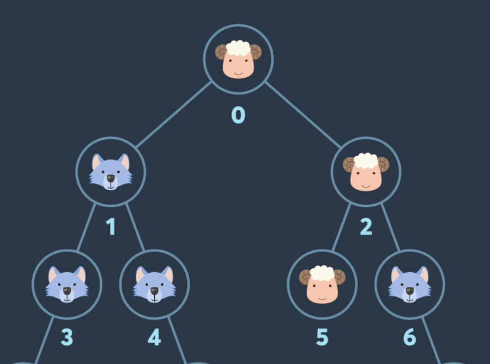

# 1. 문제 파악

## 1-1. 주어진 정보

- `info`: 노드가 양인지 늑대인지를 담은 배열. 즉 이 배열의 길이가 노드의 개수.
- `edges`: 간선 정보

- `N = 17`

## 1-2. 문제 링크

https://school.programmers.co.kr/learn/courses/30/lessons/92343

# 2. 내 풀이

## 2-1. 알고리즘

접근 1) 일반적인 DFS. but 한번 방문 이후 자식 노드가 아니더라도 재방문이 가능. 예를 들어 아래 사진에서 0 > 2 > 5 > 1 방문이 가능.



접근 2) 그렇다면 하나의 기준 노드마다 다음 노드를 탐색할 때, 전체 노드를 대상으로 탐색을 해야하지 않을까? 백트래킹으로 생각해 보자.

- 가지치기를 어떻게 해야 할까?
- 양 <= 늑대인 경우
- **아직 부모 노드를 방문하지 않은 경우 (이 경우에는 자식 노드 방문 불가)**

여기에 현재 노드 방문처리 - 방문해제를 하면서 탐색해 보자.

## 2-2. 시간복잡도

## 2-3. 풀이

```js
function solution(info, edges) {
  const N = info.length;
  const visited = new Array(N).fill(0);
  let max_sheep = 0;
  back(0, 1, 0);
  return max_sheep;

  function back(root, sheep, wolf) {
    if (sheep <= wolf) return;
    if (max_sheep < sheep) max_sheep = sheep;

    visited[root] = 1;
    for (const [parent, child] of edges) {
      if (visited[parent] && !visited[child]) {
        visited[child] = 1;
        if (info[child] === 0) back(child, sheep + 1, wolf);
        else back(child, sheep, wolf + 1);
        visited[child] = 0;
      }
    }
  }
}
```

1.  노드의 개수만큼 방문 배열 `visited` 만들기
2.  백트래킹 함수 `back`

    2-1. `sheep <= wolf` 면 `return` (가지치기)

    2-2. 그렇지 않은 경우, `max_sheep` 보다 `sheep`이 더 큰 경우 `max_sheep` 갱신

    2-3. 현재 체크하고 있는 루트 노드(기준점) 방문처리

    2-4. 모든 간선 순회. 단 부모는 방문했지만 자식은 방문하지 않았을 때만 (가지치기)

        - 자식 방문처리
        - 양/늑대 여부에 따라 자식을 기준점으로 해서 백트래킹
        - 자식 방문해제

3.  모든 노드가 기준점이 되어 전체 방문처리가 되면 함수 종료, `max_sheep` `return`
