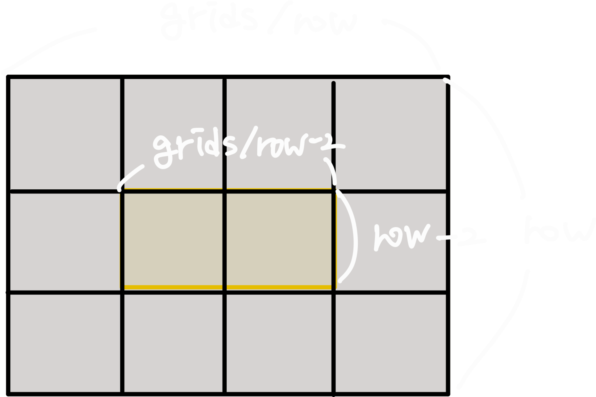

# 1. 문제 파악

## 1-1. 주어진 정보

- `brown`: 8 이상 5000 이하 자연수
- `yellow`: 1 이상 200만 이하 자연수
- 카펫의 가로 길이 >= 세로 길이

## 1-2. 문제 링크

https://school.programmers.co.kr/learn/courses/30/lessons/42842

# 2. 내 풀이

## 2-1. 알고리즘

- `brown` + `yellow`가 전체 카펫 격자의 개수이므로, 카펫의 세로 또는 가로를 구하면 나머지도 알 수 있다.
- 카펫의 최소 세로길이인 3부터 시작해서 완전탐색하여 세로길이를 찾아보자.
- 그런데 세로길이가 가로길이보다 같거나 작으므로, 전체 격자의 제곱근까지만 탐색하면 된다.

## 2-2. 시간복잡도

- `O(N^1/2)`, 이때 `N = brown + yellow, 즉 약 200만`

## 2-3. 풀이

```js
function solution(brown, yellow) {
  const grids = brown + yellow;

  for (let row = 3; row * row <= grids; row++) {
    if (!(grids % row) && (grids / row - 2) * (row - 2) === yellow) {
      return [grids / row, row];
    }
  }
}
```

1. 주어진 카펫의 전체 격자 수 구하기
2. 최소 세로길이인 3부터 시작하여 `grids`의 제곱근까지 순회하며 세로길이 찾기
3. 조건은 전체 넓이 `grids`가 세로길이 `row`로 나누어떨어지고, `grids`와 `row`를 이용해서 구한 `yellow`의 넓이가 주어진 `yellow`와 같아야 함
4. 조건을 만족하는 길이 발견 시 전체 넓이를 세로길이로 나누어 `[가로, 세로]` 반환


