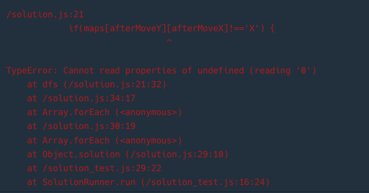

# 문제
https://school.programmers.co.kr/learn/courses/30/lessons/154540

# 1. 문제 파악

- 문제의 요점 : 연결된 땅의 합을 구하기
- X 혹은 1-9 숫자
    - X : 바다, 숫자는 무인도
- 상+하+좌+우로 연결된 땅 = 최대 머무룰 수 있는 날짜

# 2. 내 풀이

> 알고리즘 : DFS
> 

> 시간복잡도 : `O(n*m)` n은 maps의 길이, m은 maps[i]의 길이
> 

```tsx
const DIRECTION_LIST = [
    {y:1,x:0},
    {y:-1,x:0},
    {y:0,x:-1},
    {y:0,x:1},
]
function solution(maps) {
    var answer = [];

    maps = maps.map(mapColumn => mapColumn.split('').map(it=>{
        return it==='X' ? it : +it
    }));
    const minX = 0, minY = 0;
    const maxX = maps[0].length-1, maxY = maps.length-1; 
    let sum = 0;
    
    function dfs ({y,x}) {
        for (const {y:directionY,x:directionX} of DIRECTION_LIST){
            const afterMoveY = y + directionY;
            const afterMoveX = x + directionX;
            if(afterMoveX<minX || afterMoveY<minY || afterMoveX>maxX || afterMoveY>maxY) continue;
            if(maps[afterMoveY][afterMoveX]!=='X') {
                sum += maps[afterMoveY][afterMoveX]
                maps[afterMoveY][afterMoveX] = 'X'
                dfs({y:afterMoveY,x:afterMoveX});
            }
        }
    }
    const array = [];
    maps.forEach((mapColumn,y) => {
        mapColumn.forEach((it,x)=>{
            if(maps[y][x] !== 'X') {
                sum = maps[y][x];
                maps[y][x]='X'
                dfs({y,x},sum)
                array.push(sum)
            }
        })
    })
    
    array.sort((a,b)=>a-b)
    return array.length===0?[-1]:array;
}
```

## 풀이 방법

평범한 DFS문제이다.

1. 모든 배열을 순회한다. 
2. 숫자라면, 즉 섬이라면, DFS문을 순회한다.
3. 한 번 순회한 점은 다시 순회하지 않기 위해 X로 값을 변경해준다.
4. 순회를 시작할 때, DFS문을 시작한다. DFS문 안에서는 상하좌우 네 방향을 또 순회하며 이동할 수 있다면(X가 아니라면) 이동한다. 이 때, X로 값을 변경하여 방문했음을 체크한다.
5. 더 이상 근접한 방문할 수 있는 섬이 없다면, 이중 forEach문 안에서 다음 X가 아닌 점을 찾아 DFS문을 또 실행한다.

# 느낀 점

maxX와 maxY를 maps[0].length, maps.length로 설정해서 이걸 찾는데 오래걸렸다. 배열은 index가 0부터 시작하기에 1을 뺴줘야 하는데 빼지 않았다.



**Cannot read properties of undefined (reading '0')**

이 에러는 배열의 찾을 수 없는 요소에 접근하려 할 때 발생하는 에러임을 꼭 기억하자.

dfs의 인자로 객체로 넘겼는데, y인지, x인지 안헷갈리게 되어서 나름 괜찮았던 거 같다.