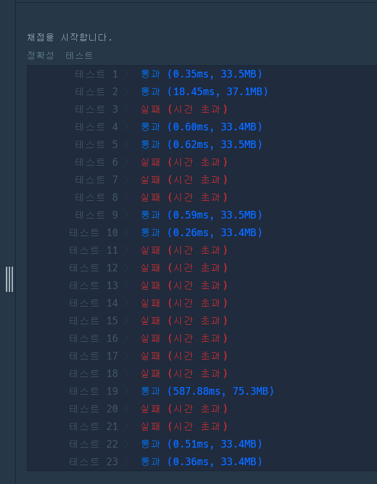

# 문제 링크

프로그래머스 Lv2. 미로 탈출
https://school.programmers.co.kr/learn/courses/30/lessons/159993

# 1. 내 풀이

```js
function solution(maps) {
    let visited = Array.from(Array(maps.length), () => Array(maps[0].length).fill(0));
    for (let i = 0; i < maps.length; i++) {
        for (let j = 0; j < maps[0].length; j++) {
            if (maps[i][j] == 'S') {
                search(maps, i, j, 'L', visited, 0);
                break;
            }
        }
    }

    if (arrive.length == 0) return -1;

    let min = Infinity;
    arrive.forEach((v) => {
        min = Math.min(min, v[2]);
    });

    visited = Array.from(Array(maps.length), () => Array(maps[0].length).fill(0));
    let [lever_i, lever_j] = arrive[0];
    arrive = [];
    search(maps, lever_i, lever_j, 'E', visited, min);

    if (arrive.length == 0) return -1;

    min = Infinity;
    arrive.forEach((v) => {
        min = Math.min(min, v[2]);
    });

    return min;
}

const moves = [
    [0, 1],
    [0, -1],
    [1, 0],
    [-1, 0],
];

let arrive = [];

function search(maps, i, j, target, visited, count) {
    if (i < 0 || i >= maps.length || j < 0 || j >= maps[0].length) {
        return;
    }

    if (maps[i][j] == 'X') {
        return;
    }

    if (visited[i][j] == 1) {
        return;
    }

    if (maps[i][j] == target) {
        arrive.push([i, j, count]);
        return;
    }

    for (let move of moves) {
        let move_i = i + move[0];
        let move_j = j + move[1];

        visited[i][j] = 1;
        search(maps, move_i, move_j, target, visited, count + 1);
        visited[i][j] = 0;
    }
}
```

## 풀이 방법

<1차 시도>
Lever까지 가는 최소시간 + Exit까지 가는 최소시간.  
2가지 경우를 각각 dfs를 이용해서 최소값을 구하고 더해주었다.

아무래도 dfs를 이용하게 되면 나올수 있는 모든 경우의 수를 찾게 된다. 모든 탐색이 끝난 후 나온 결과값들 중에서 최소값을 골라야 한다.

그래서 시간이 오래 걸린다.

bfs로 바꿔 구현 해야 겠다. 추가로 2가지 경우를 나눠서 비슷한 코드를 구현하다 보니 같은 내용이 반복된다. 중복을 피하도록 함수를 만들어 사용해보자.

# 2. 느낀 점

# 3. 배운 점
