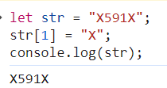

# 문제 링크

프로그래머스 Lv2. 무인도 여행
https://school.programmers.co.kr/learn/courses/30/lessons/154540

# 1. 내 풀이

```js
function solution(maps) {
    const answer = [];
    for (let i = 0; i < maps.length; i++) {
        for (let j = 0; j < maps[0].length; j++) {
            if (maps[i][j] == 'X') {
                continue;
            }

            answer.push(dfs(maps, i, j));
        }
    }

    return answer.length > 0 ? answer.sort((a, b) => a - b) : [-1];
}

function bfs(maps, i, j) {
    const moves = [
        [1, 0],
        [-1, 0],
        [0, 1],
        [0, -1],
    ];

    const queue = [];
    let queueIdx = 0;
    queue.push([i, j]);

    let sum = 0;

    // 변수 재활용
    let site; // i j
    let target; // 원소
    let next_i; // 다음 i
    let next_j; // 다음 j

    while (queue.length > queueIdx) {
        // queue가 비워질 때까지
        site = queue[queueIdx++]; // dequeue
        target = maps[site[0]][site[1]];
        if (target == 'X') {
            continue;
        }

        sum += +target;
        let str = maps[site[0]];
        maps[site[0]] = str.slice(0, site[1]) + 'X' + str.slice(site[1] + 1);

        for (let move of moves) {
            next_i = site[0] + move[0];
            next_j = site[1] + move[1];

            if (next_i < 0 || next_i >= maps.length) continue;
            if (next_j < 0 || next_j >= maps[0].length) continue;

            queue.push([next_i, next_j]);
        }
    }

    return sum;
}

function dfs(maps, i, j) {
    const moves = [
        [1, 0],
        [-1, 0],
        [0, 1],
        [0, -1],
    ];
    const stack = [];
    let sum = 0;

    stack.push([i, j]);

    let popped;
    let target;
    let next_i;
    let next_j;
    while (stack.length > 0) {
        popped = stack.pop();
        target = maps[popped[0]][popped[1]];
        if (target == 'X') {
            continue;
        }

        sum += +target;
        let str = maps[popped[0]];
        maps[popped[0]] = str.slice(0, popped[1]) + 'X' + str.slice(popped[1] + 1);

        for (let move of moves) {
            next_i = popped[0] + move[0];
            next_j = popped[1] + move[1];

            if (next_i < 0 || next_i >= maps.length) continue;
            if (next_j < 0 || next_j >= maps[0].length) continue;

            stack.push([next_i, next_j]);
        }
    }

    return sum;
}
```

## 풀이 방법

bfs 활용  
  
dfs 활용  


# 2. 느낀 점

자바스크립트 문법에 대한 정확한 이해가 필요하다.
테스트에서 계속 실패했는데, 그 이유가 자바스크립트 문법과 함수에 대한 이해가 부족해서 발생한 문제였다. 이 참에 string과 sort 함수에 대해 확실히 정리하자

# 3. 배운 점

1.  문자열 수정하기  
       
    javascript의 문자열을 index로 바로 접근할 수 있으나, 변경은 불가능하다.

    -   slice 함수를 이용해 target 문자만 제거하고 이어 붙였다.
        (replace 함수를 이용할 때 내가 원하는 문자만 target 하기 어려웠다)
    -   visited 배열을 만들면, 문자열을 새로 만들어줄 필요가 없다.

    다른 사람 코드 참고. string(문자열)을 문자로 쪼개 배열에 할당했다. visited도 필요 없고 코드가 훨씬 깔끔했다.

    ```js
    function solution(maps) {
        const arrMap = maps.map((string) => string.split(''));
        const rowLength = arrMap.length - 1;
        const columnLength = arrMap[0].length - 1;
        const dRow = [1, 0, -1, 0];
        const dCol = [0, 1, 0, -1];
        const result = [];

        const bfs = (row, col, count) => {
            if (row > rowLength || col > columnLength || row < 0 || col < 0) {
                return count;
            }
            if (arrMap[row][col] === 'X') {
                return count;
            }

            count += Number(arrMap[row][col]);
            arrMap[row][col] = 'X';

            for (let i = 0; i < 4; i++) {
                count = bfs(row + dRow[i], col + dCol[i], count);
            }

            return count;
        };

        for (let i = 0; i <= rowLength; i++) {
            for (let j = 0; j <= columnLength; j++) {
                if (arrMap[i][j] === 'X') {
                    continue;
                }
                result.push(bfs(i, j, 0));
            }
        }

        return result.length ? result.sort((a, b) => a - b) : [-1];
    }
    ```

2.  sort callback 함수

```js
answer.sort();
```

를 해서 답을 제출 했는데, 계속 실패했다.
  
원인을 찾을수 없었다가 질문하기 글을 통해서 콜백 함수를 써서 해결했다.

